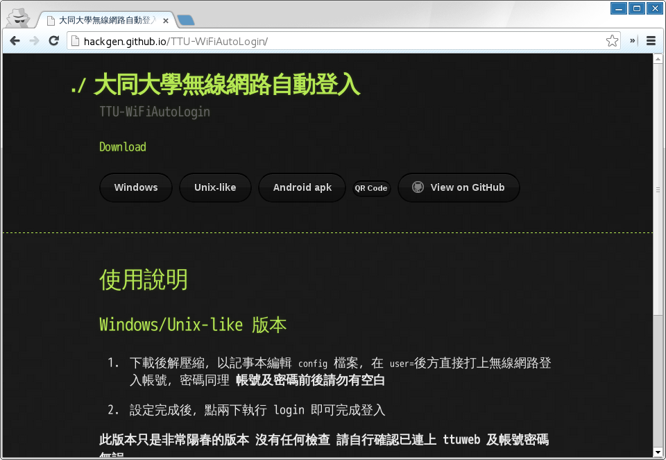
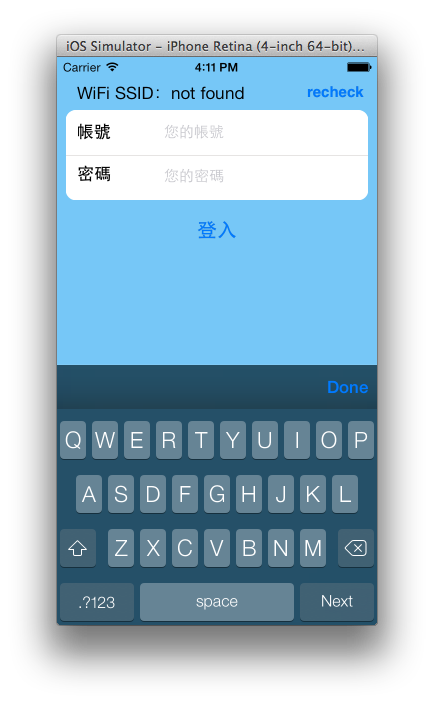
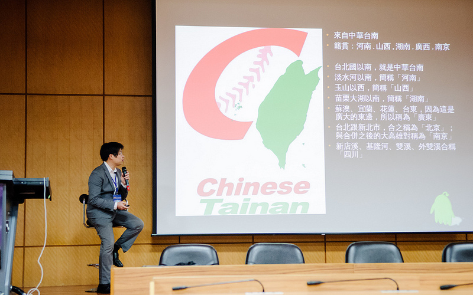

title: SITCON HackGen - TTU-WiFiAutoLogin
output: index.html

--

<h1 style="font-size: 72px">
  SITCON HackGen 
  TTU-WiFiAutoLogin
</h1>
 

## SITCON 2013, 2014 總召
## Denny Huang

--

<h1>
  
</h1>
## http://sitcon.org/

--

<h1>
  
</h1>
## http://hackgen.sitcon.org/

--

# 緣起

--

--

  

--

<h2>

http://hackgen.github.io/TTU-WiFiAutoLogin/
</h2>

--

<h2>
  
</h2>

--

# 可使用平台
## Windows / Unix-like / Android

--

# 技術原理

--

# Shell Script

--

# GnuWin32

--

# 困難之處...

--

--

<h1>
  
</h1>
## 不斷換 MAC 的悲慘世界 Orz

--

# Android Devices

--

--

# DEMO

--

<h1 style="font-size: 72px">
Fork me on github
</h1>
## https://github.com/HackGen/TTU-WiFiAutoLogin

--

<h2>
   
  <a href="https://play.google.com/store/apps/details?id=idv.PN_Wu.NcutWiFi" target="_blank">勤益一鍵通</a> / PN Wu
</h2>

--

  
  
</img>
## iOS / Frank Wu

--

# 工商服務時間

--

# SITCON 2014
## 2014 / 03 / 15 ＠  中央研究院人文社會館

--

--

--

--

--

--

<h1 style="font-size:72px">11 月 Call For Paper</h1>
<h2>
密切注意 SITCON <a href="https://www.facebook.com/groups/sitcon.tw/" target="_blank">FB社團</a> / <a href="https://www.facebook.com/SitconTW" target="_blank">粉絲團</a>
</h2>

--

<h1 style="font-size:72px">如果貴公司想要新鮮的肝</h1>

--

# 歡迎與我們聯繫
<h2>
  <a href="mailto:contact@sitcon.org">contact@sitcon.org</a>
</h2>

--

<h1 style="font-size:72px">Thanks for listening</h1>
